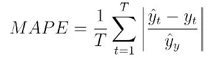

# Energy expenditure prediction from wearable grist sensors
It has been estimated that the time needed to solve this task is about 3 hours.
 
A wearable wrist is a which contains an accelerometer and a heart rate sensor. The aim  of this work is to develop a system that analyses the activity donde by the user based on the information from the sensors.  The energy expenditure and activity level of the person must be predicted from the accelerometry and pulse data recorded by the wearable device.
 
A person's energy expenditure depends on their activity, metabolism and lifestyle, among others. For example, many smartwaches are now able to approximate the user's energy expenditure based on their activity. Taking this into account, predict the energy expenditure of a person from their accelerometry and heart rate data.
 
The files accs_x.csv, accs_y.csv and accs_z.csv match with the accelerations for each of the axes. The energy.csv file means the data of the energy associated to the accelerometry and heart rate by time interval. 
 
The metric with the prediction error will be measured is the ASM (Median Absolute Percentage Error), expressed by the following formula:
 

Where T is the number of samples, y^t the real value and yt the prediction.
